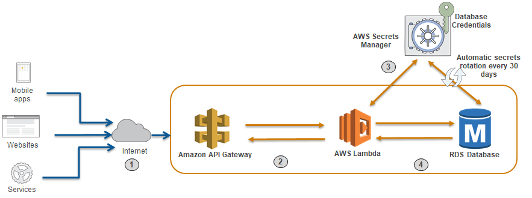

# Secure your database credentials using AWS Secrets Manager

## [AWS Blog](https://aws.amazon.com/blogs/security/how-to-securely-provide-database-credentials-to-lambda-functions-by-using-aws-secrets-manager/)

## Solution Architecture



## Security scan
[Bandit](https://bandit.readthedocs.io/en/latest/) was used to scan Python code in this sample project. 
Results are show below; there are 3 low issues - 2 for initializing password variable that is replaced with the secret before connecting to the database and 1 for introducing an artificial delay. There 3 issues can be safely ignored.  
```
Run started:2022-04-21 20:01:36.475937

Test results:
>> Issue: [B105:hardcoded_password_string] Possible hardcoded password: 'None'
   Severity: Low   Confidence: Medium
   CWE: CWE-259 (https://cwe.mitre.org/data/definitions/259.html)
   Location: ../cf/secrets_manager/aws-sm-lambda-code/LambdaRDS_CFNInit_Clean.py:33:15
   More Info: https://bandit.readthedocs.io/en/1.7.4/plugins/b105_hardcoded_password_string.html
32	    global conn
33	    password = "None"
34	    # Create a Secrets Manager client
35	    session = boto3.session.Session()

--------------------------------------------------
>> Issue: [B105:hardcoded_password_string] Possible hardcoded password: 'None'
   Severity: Low   Confidence: Medium
   CWE: CWE-259 (https://cwe.mitre.org/data/definitions/259.html)
   Location: ../cf/secrets_manager/aws-sm-lambda-code/LambdaRDS_Test_Clean.py:41:15
   More Info: https://bandit.readthedocs.io/en/1.7.4/plugins/b105_hardcoded_password_string.html
40	    global conn
41	    password = "None"
42	    # Create a Secrets Manager client
43	    session = boto3.session.Session()

--------------------------------------------------
>> Issue: [B311:blacklist] Standard pseudo-random generators are not suitable for security/cryptographic purposes.
   Severity: Low   Confidence: High
   CWE: CWE-330 (https://cwe.mitre.org/data/definitions/330.html)
   Location: ../cf/secrets_manager/aws-sm-lambda-code/LambdaRDS_Test_Clean.py:116:19
   More Info: https://bandit.readthedocs.io/en/1.7.4/blacklists/blacklist_calls.html#b311-random
115	        # Introducing artificial random delay to mimic actual DB query time. Remove this code for actual use.
116	        time.sleep(random.randint(1, 3))
117	        with conn.cursor() as cur:

--------------------------------------------------

Code scanned:
	Total lines of code: 531
	Total lines skipped (#nosec): 0
	Total potential issues skipped due to specifically being disabled (e.g., #nosec BXXX): 0

Run metrics:
	Total issues (by severity):
		Undefined: 0
		Low: 3
		Medium: 0
		High: 0
	Total issues (by confidence):
		Undefined: 0
		Low: 0
		Medium: 2
		High: 1
Files skipped (0):
```

## Implementation Steps
+ Download all the code from this folder locally
+ From a command line, navigate to "aws-sm-lambda-code" folder and create a new Python [virtual environment](https://docs.python.org/3/library/venv.html)
+ After activating the new virtual environment, use the command "pip install -r requirements.txt -t ." to install the dependencies in the current folder
+ Create a zip file called "aws-sm-lambda-code.zip" with all the contents of the "aws-sm-lambda-code" folder
+ Create a new S3 bucket and upload the "aws-sm-lambda-code.zip" file into the new bucket
+ Open the "secretsmanager_IaC.yml" CloudFormation template to update the CIDR blocks and S3 bucket name
+ Update the "secretsmanager_IaC.yml" CloudFormation template file to use a supported AWS Lambda Python version
+ Go to AWS Console to execute the updated CloudFormation template 
+ Go confirm the outcome presented in the AWS Blog with results in the newly provisioned environment

## Cleanup
To cleanup the resources created using the CloudFormation stack, use AWS Console to delete the CloudFormation stack